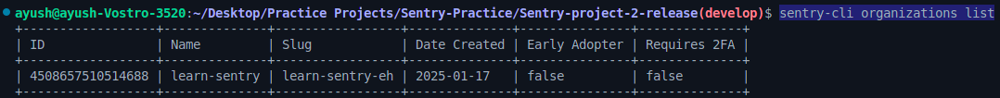
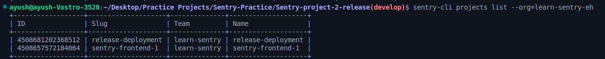
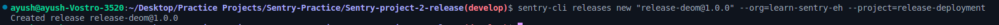
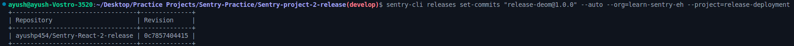
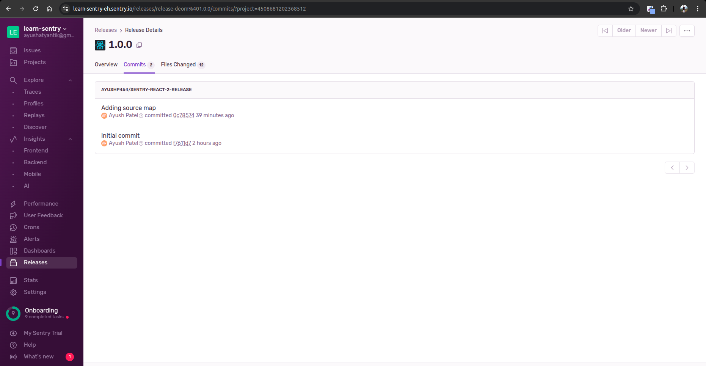
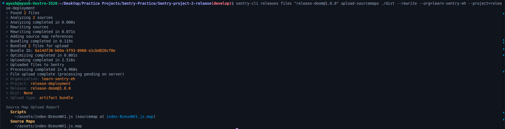
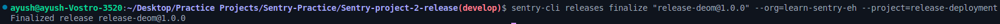
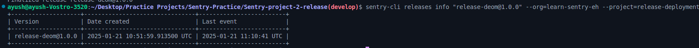
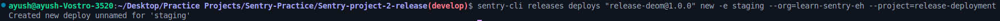
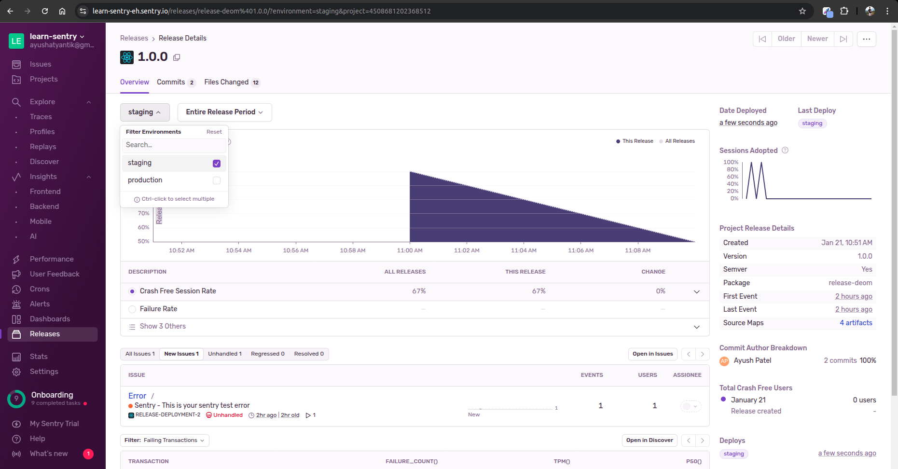

# Create and Release Deployment Tutorial

- Clone this repo
- Make sure you also create a new sentry project sentry system and paste your configuration setting in main.jsx file
- Create a repo on github and upload your source code to github
- In sentry integrate the github and do configuration:
  select github project and assign current project to sentry created project.
- Add source map using below command
```bash
npx @sentry/wizard@latest -i sourcemaps
```

## Create Rlease commands:
1. Install sentry cli in your system.
```bash
npm install -g @sentry/cli
```

2. Login in your sentry cli
- It will ask auth token. (create token in sentry UI and paste it if you don't have)
```bash
sentry-cli login
```

3. List down all the `organizations` details like: ***ID***, ***Name***, ***Slug***, ***Date Created***, ***Early Adopter***, etc.
- and note down ***ID*** or ***Slug*** in which your created your sentry project.
```bash
sentry-cli organizations list
```


4. List down of all the project of selected organizatins.
- and note down ***ID*** or ***Slug*** of your sentry project.
- replace `learn-sentry-eh` with your noted **Organization ID or Slug**
```bash
sentry-cli projects list --org=learn-sentry-eh
```


5. Create or update your release 
- We are taking Release name = ***"release-deom@1.0.0"***
- Release name is same as like we written in `/src/main.jsx` file
- replace `learn-sentry-eh` with your noted **Organization ID or Slug**
- replace `release-deployment` with your noted **Project ID or Slug**
```bash
sentry-cli releases new "release-deom@1.0.0" --org=learn-sentry-eh --project=release-deployment
```


6. Associate commits from current branch
- replace `learn-sentry-eh` with your noted **Organization ID or Slug**
- replace `release-deployment` with your noted **Project ID or Slug**
```bash
sentry-cli releases set-commits "release-deom@1.0.0" --auto --org=learn-sentry-eh --project=release-deployment
```

- You can show in your sentry in ***release section > specific release*** all commits will be listed.

- **Note:** Associate commits from ***Specific*** branch
```bash
sentry-cli releases set-commits "release-demo@1.0.0" --org=learn-sentry-eh --project=release-deployment --commit=<repo>@<branch>
```

7. Upload your source maps (Make sure you already build your app using `npm run build`)
- ***Note***: You can also make configuration in `vite.config.js` file so you no need to do manually release every time using this listed commands. You just need to create `.env` file assign the all the values in like `authToken`(sentry auth token), `environment` (deployment enviornment), `SENTRY_RELEASE` (for specifing your release number with name)
- replace `learn-sentry-eh` with your noted **Organization ID or Slug**
- replace `release-deployment` with your noted **Project ID or Slug**
```bash
sentry-cli releases files "release-deom@1.0.0" upload-sourcemaps ./dist --rewrite --org=learn-sentry-eh --project=release-deployment
```


8. Finalize release
- replace `learn-sentry-eh` with your noted **Organization ID or Slug**
- replace `release-deployment` with your noted **Project ID or Slug**
```bash
sentry-cli releases finalize "release-deom@1.0.0" --org=learn-sentry-eh --project=release-deployment
```


9. Verify release
- replace `learn-sentry-eh` with your noted **Organization ID or Slug**
- replace `release-deployment` with your noted **Project ID or Slug**
```bash
sentry-cli releases info "release-deom@1.0.0" --org=learn-sentry-eh --project=release-deployment
```


10. Deploy the release to specific ***Enviornment***
- I am deploying for the `staging` enviormnet.
```bash
sentry-cli releases deploys "release-deom@1.0.0" new -e staging --org=learn-sentry-eh --project=release-deployment
```

- You can also see in `Sentry release > select your release veersion`
